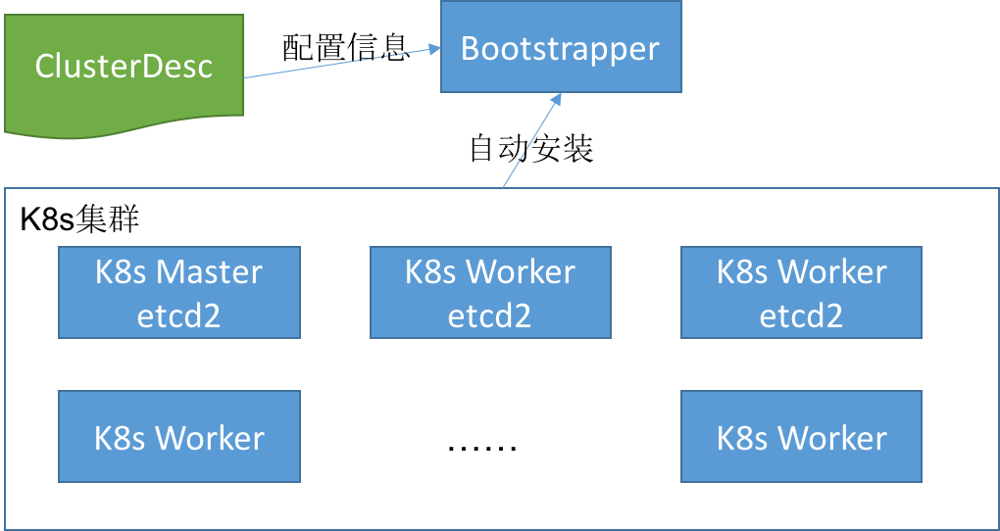

# Bootstrapper
Bootstrapper是kubernetes集群的自动安装软件。它在集群中的一台机器上使用docker方式启动，为kubernetes集群自动化部署提供服务。

Bootstrapper程序通过执行```docker run -d [bootstrapper_image_name:tag] -v /path/to/ClusterDesc.yaml:/path/to/Clusterdesc.yaml```启动，之后程序会读取配置文件“ClusterDesc.yaml”，根据配置 ***在一个docker image中*** 启动dnsmasq(DHCP, DNS, PXE, tftp), docker registry, cloud-config-server,CoreOS镜像更新等服务。

# Design
## 环境需求
* Bootstrapper需部署在集群中的一台配置了静态IP的机器
* Bootstrapper所在的机器，需要足以运行docker 1.10以上版本的kernel的任意Linux发行版
* 如果Bootstrapper所在的机器能访问Internet，则可以从公网的registry下载Bootstrapper程序的docker镜像；如果没有，则可以从本地的客户端（比如你的笔记本电脑）上传这个镜像到这台机器并执行```docker load [yourimagefile.tar]```
* Bootstrapper需要以特权模式运行，所以你需要由这台就的root权限
* 计划要自动安装CoreOS和kubernetes的集群机器要和bootstrapper所在的机器网络连通（2层连通）。

## 自动部署步骤
***使用bootstrapper来自动安装k8s集群的步骤如下图***



***详细流程描述***

1. 规划集群，并且把规划描述成[ClusterDesc配置文件](https://raw.githubusercontent.com/k8sp/auto-install/master/cloud-config-server/template/unisound-ailab/build_config.yml)，比如如哪个机器作为master，哪些机器作为etcd集群，哪些作为worker。每台机器通过MAC地址唯一标识。
1. 管理员在一台预先规划好的的机器上，下载／上传bootstrapper的docker image，并通过docker run启动bootstrapper。启动成功后，bootstrapper会提供DHCP, DNS(服务于物理节点), PXE, tftp, cloud-config HTTP服务, CoreOS镜像自动更新服务。
1. 将集群中的其他所有节点开机，并从网络引导安装。即可完成整个集群的初始化。
1. 每启动一台新的机器（网络引导），先从DHCP获取一个IP地址，DHCP server将启动引导指向PXE server，然后由PXE server提供启动镜像（保存在tftpserver），至此，新的机器可以完成内存中的CoreOS引导，为CoreOS操作系统安装提供环境。
1. 由于PXE server配置了initrd参数，指定了install.sh的cloud-config文件（网络引导cloud-config），PXE引导启动后，将使用HTTP访问cloud-config-server，获得到这个install.sh。install.sh执行coreos-install命令，把CoreOS系统安装到当前机器并reboot。安装命令coreos-install 也可以指定一个cloud-config文件(系统安装cloud-config)，这个文件是cloud-config-server自动生成生成的，这个cloud-config文件将本机安装成为对应的kubernetes集群节点（由之前的ClusterDesc指定的角色）。
1. 机器重启后，由于已经安装了系统，磁盘上有MBR，则使用磁盘引导。磁盘上的CoreOS启动后，会根据之前coreos-install指定的cloud-config文件完成配置，此时kubernetes的相关组件也完成了启动并把本机的hostname汇报给kubernetes master(hostname用mac地址生成)。

* ***IP地址的分配和获取：***
  网络配置统一都使用了DHCP，由dnsmasq统一管理和分配。在IP地址租期之内，DHCP会分配给本机一个相对稳定的IP地址。如果超过了租期，物理节点就会获得一个不同的IP，但由于kubernetes worker是根据mac地址生成的hostname上报给master的，之前给这个node打的标签也不会丢失。***所以在配置的时候需要着重考虑租期的配置***


## 组件功能
### Bootstrapper main
在build docker镜像时，指定ENTRYPOINT参数即为本程序，本程序使用Go语言开发，将作为整个bootstrapper镜像的入口程序，完成各组件的配置和启动工作。

bootstrapper main读取ClusterDesc配置文件，并生成dnsmasq的配置文件：/etc/dnsmasq.conf；PXE的配置文件：/var/lib/tftpboot/pxelinux.cfg/default；install.sh脚本：/var/www/html/cloud-configs/install.sh；cloud-config-server的配置文件：clusterdesc.yaml；docker registry的配置文件：/etc/docker/registry/config.yml。

完成配置后，bootstrapper main会分别启动dnsmasq, cloud-config-server, docker registry, CoreOS镜像自动更新程序（可选）。

### dnsmasq
dnsmasq在集群中提供DHCP, DNS(物理机的DNS), PXE服务。使用docker启动dnsmasq的试验方法可以参考：https://github.com/k8sp/auto-install/issues/102

### cloud-config-server
cloud-config-server是使用Go语言开发的一个HTTP Server，将提供安装kubernetes组件用到的需要通过HTTP访问的所有资源。包括：

* install.sh, 访问url如: http://youserver.com/install.sh
* CoreOS镜像, 访问url如: http://youserver.com/stable/1010.5.0/coreos_production_image.bin.bz2
* 根据模版自动生成的cloud-config文件, 访问url如: http://yourserver.com/cloud-configs/08:00:36:a7:5e:9f.yaml
* 自动生成的证书, ca.pem以及为api-server, worker, client生成的证书

***注: cloud-config-server可以替换之前nginx的功能，就没必要再多部署一个组件了。***

### docker registry
在bootstrapper所在的机器上，启动一个docker registry，这样在kubernetes master/worker启动时需要的docker镜像（hyperkube, kubelet, pause, skydns, kube2sky等）就可以不需要翻墙即可完成启动。这样的好处是：

1. 在内网可以获得最快的镜像下载和启动速度，即使翻墙，下载镜像的速度也会很慢。
1. 不需要额外搭建翻墙环境

这样，bootstrapper在编译的时候就需要下载好docker registry的镜像，kubernetes需要的镜像。启动bootstrapper的时候，先把docker registry的镜像load到docker daemon中，然后再把kubernetes用到的镜像push到启动好的registry中，并打上对应的tag（cloud-config-server生成的cloud-config文件使用的镜像的tag）

### CoreOS镜像更新程序
CoreOS是需要持续升级更新来保证即时的打上各种安全补丁，防止诸如0day漏洞的问题。但在PXE安装的时候，CoreOS镜像的版本只能是当时最新的版本。所以需要有一个后台的程序，定时的不断检查CoreOS官方是否有版本的更新，如果有，则需要下载并更新cloud-config-server指向的最新的版本。

这样在集群扩容的时候，安装的CoreOS系统可以保证是最新的。同时，已经安装好的CoreOS集群如果开启了自动更新也会各自完成更新。这样集群整体的CoreOS系统可以持续保持最新。

## 编译
* 编译脚本build.sh，完成go程序编译成二进制的步骤
* Dockerfile，安装dnsmasq, docker registry，并拷贝编译好的cloud-config-server, bootstrapper main，生成一个包含所有组件的完整的镜像
* 发布脚本release.sh，执行```docker build```命令完成docker镜像的制作，并可选的完成导出tar包／push镜像

## 运行
执行下面的命令以启动bootstrapper相关组件
```
$ docker run -d \
     -v /path/to/ClusterDesc.yaml:/path/to/Clusterdesc.yaml \
     [bootstrapper_image_name:tag]
```
