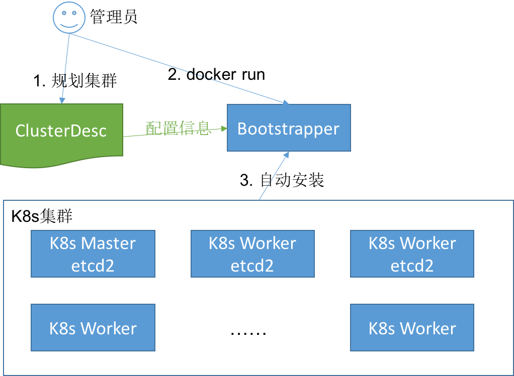

# Bootstrapper
Bootstrapper是kubernetes集群的自动安装软件。它使用集群中的一台机器，为kubernetes集群自动化部署提供服务。

Bootstrapper程序读取配置文件“ClusterDesc”，根据配置启动dnsmasq(DHCP, DNS, PXE, tftp), docker registry, cloud-config-server,CoreOS镜像更新等服务。Bootstrapper执行结束后退出，并在本机配置好所有k8s自动部署所需的初始化服务。如果用户配置了自动从互联网更新CoreOS镜像，Bootstrapper还会启动一个后台程序，即时的更新PXE指向最新的版本。

# Design
Bootstrapper需部署在集群中的一台预先安装好CoreOS并配置了静态IP的机器，并在这台机器上使用docker的方式启动必要的组件，如：dnsmasq，cloud-config-server, docker registry(可选), CoreOS镜像更新程序(可选)。

环境需求

| 环境        | 要求           |
| ----------------- |:-------------------------------------------------------------------------------:|
|    客户端/笔记本    | 可以ssh连接到Bootstrapper所在的服务器上，Internet访问，Linux go语言编译环境            |
| Bootstrapper服务器 | CoreOS操作系统，docker运行环境，分配好的静态IP，Internet访问(可选)                     |
| Bootstrapper安装包 | 编译好的bootstrapper程序、cloud-config-server程序，dnsmasq、docker registry镜像tar包 |

## 自动部署步骤
在初始化kubernetes集群的时候，集群管理员需要：

1. 规划集群，并且把规划描述成[ClusterDesc配置文件](https://raw.githubusercontent.com/k8sp/auto-install/master/cloud-config-server/template/unisound-ailab/build_config.yml)，比如如哪个机器作为master，哪些机器作为etcd集群，哪些作为worker。机器通过MAC地址唯一标识。
1. 管理员在一台已经预先安装好CoreOS的机器上，下载Bootstrapper的安装包，并启动安装启动Bootstrapper
1. 将集群中的其他所有节点开机，并从网络引导安装。即可完成整个集群的初始化。
1. 每启动一台新的机器（网络引导），先从DHCP获取一个IP地址，DHCP server将启动引导指向PXE server，然后由PXE server提供启动镜像（保存在tftpserver），至此，新的机器可以完成内存中的CoreOS引导，为CoreOS操作系统安装提供环境。
1. 由于PXE server配置了initrd参数，指定了install.sh的cloud-config文件（网络引导cloud-config），PXE引导启动后，将使用HTTP访问cloud-config-server，获得到这个install.sh。install.sh执行coreos-install命令，把CoreOS系统安装到当前机器并reboot。安装命令coreos-install 也可以指定一个cloud-config文件(系统安装cloud-config)，这个文件是cloud-config-server自动生成生成的，这个cloud-config文件将本机安装成为对应的kubernetes集群节点（由之前的ClusterDesc指定的角色）。
1. 机器重启后，由于已经安装了系统，磁盘上有MBR，则使用磁盘引导。磁盘上的CoreOS启动后，会根据之前coreos-install指定的cloud-config文件完成配置，此时kubernetes的相关组件也完成了启动并把本机的hostname汇报给kubernetes master(hostname用mac地址生成)。

* ***IP地址的分配和获取：***
  网络配置统一都使用了DHCP，由dnsmasq统一管理和分配。在IP地址租期之内，DHCP会分配给本机一个相对稳定的IP地址。如果超过了租期，物理节点就会获得一个不同的IP，但由于kubernetes worker是根据mac地址生成的hostname上报给master的，之前给这个node打的标签也不会丢失。***所以在配置的时候需要着重考虑租期的配置***

集群规划如下图：

## 组件功能
### Bootstrapper main
使用Go语言开发，bootstrapper main函数读取ClusterDesc配置文件，并负责分别调用下面的子模块，以自动的完成这台机器上各组件的启动和配置。下面的几个模块均可以并行的启动，所以需要使用go routine的方式完成。

### dnsmasq
dnsmasq在集群中提供DHCP, DNS(物理机的DNS), PXE服务。使用docker启动dnsmasq的试验方法可以参考：https://github.com/k8sp/auto-install/issues/102

Bootstrapper的initdnsmasq模块同样使用Go语言开发，程序使用Docker client API访问bootstrapper所在的服务器的docker daemon，完成dnsmasq的配置和启动。dnsmasq的配置项由bootstrapper main 函数传给initdnsmasq模块。

### cloud-config-server
cloud-config-server是使用Go语言开发的一个HTTP Server，将提供安装kubernetes组件用到的需要通过HTTP访问的所有资源。包括：

* install.sh, 访问url如: http://youserver.com/install.sh
* CoreOS镜像, 访问url如: http://youserver.com/stable/1010.5.0/coreos_production_image.bin.bz2
* 根据模版自动生成的cloud-config文件, 访问url如: http://yourserver.com/cloud-configs/08:00:36:a7:5e:9f.yaml
* 自动生成的证书, ca.pem以及为api-server, worker, client生成的证书

***注: cloud-config-server可以替换之前nginx的功能，就没必要再多部署一个组件了。***

### docker registry
在bootstrapper所在的机器上，启动一个docker registry，这样在kubernetes master/worker启动时需要的docker镜像（hyperkube, kubelet, pause, skydns, kube2sky等）就可以不需要翻墙即可完成启动。这样的好处是：

1. 在内网可以获得最快的镜像下载和启动速度，即使翻墙，下载镜像的速度也会很慢。
1. 不需要额外搭建翻墙环境

这样，bootstrapper在编译的时候就需要下载好docker registry的镜像，kubernetes需要的镜像。启动bootstrapper的时候，先把docker registry的镜像load到docker daemon中，然后再把kubernetes用到的镜像push到启动好的registry中，并打上对应的tag（cloud-config-server生成的cloud-config文件使用的镜像的tag）

initdockerreg模块使用Go语言编写，在Bootstrapper机器上完成对docker registry的配置、启动和镜像push。同样用户配置信息也通过bootstrapper main函数传入这个模块

### CoreOS镜像更新程序
CoreOS是需要持续升级更新来保证即时的打上各种安全补丁，防止诸如0day漏洞的问题。但在PXE安装的时候，CoreOS镜像的版本只能是当时最新的版本。所以需要有一个后台的程序，定时的不断检查CoreOS官方是否有版本的更新，如果有，则需要下载并更新cloud-config-server指向的最新的版本。

这样在集群扩容的时候，安装的CoreOS系统可以保证是最新的。同时，已经安装好的CoreOS集群如果开启了自动更新也会各自完成更新。这样集群整体的CoreOS系统可以持续保持最新。

## 编译
编写一个编译脚本release.sh，完成所有模块的编译并生成一个bootstrapper程序的完整安装包，包括下面步骤：

1. bootstrapper, cloud-config-server, dnsmasq配置程序, CoreOS镜像更新程序的编译
1. 将上面的4个模块的相关程序代码封装到一个Docker image，并save成tar包
1. 下载docker registry, kubernetes, dnsmasq相关镜像，并save成tar包
1. 打包上面的镜像和程序，生成一个完整的tar包

编译脚本用到的配置从环境变量读取，比如是否下载docker registry镜像并打包，是否下载kubernetes镜像并打包等。

## 运行
获得编译步骤的tar包，解压缩，配置好ClusterDesc，运行bootstrapper程序即可。
