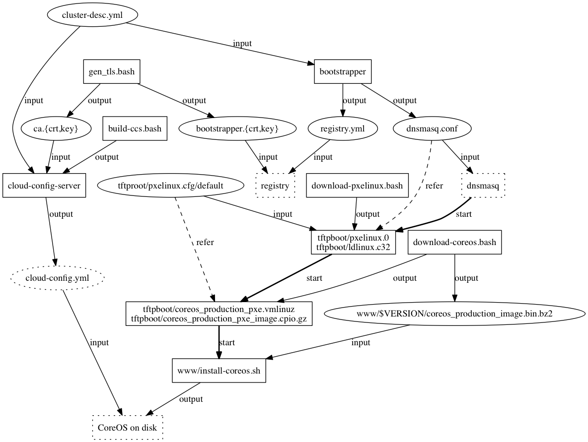

# `bsroot`

The *bootstrapper* Docker image contains services including dnsmasq,
cloud-config-server, and Docker registry.  The general idea about
*bsroot* is that we put most data files and configuration files for
these services in a directory on the host, and this directory will be
mounted into the bootstrapper container as `/bsroot`.

## Directory Structure

A breif overview of content in `bsroot` looks like the following:

```
$ tree bsroot
bsroot
├── CoreOS_Image_Signing_Key.asc
├── bootstrapper.crt
├── bootstrapper.csr
├── bootstrapper.key
├── build-ccs.bash
├── ca.crt
├── ca.key
├── ca.srl
├── cloud-config-server
├── cloud-config.template
├── cluster-desc.yml
├── dnsmasq.conf
├── download-coreos.bash
├── gen-tls.bash
├── download-pxelinux.bash
├── registry/
├── registry.yml
├── start.sh
├── tftpboot
│   ├── coreos_production_pxe.vmlinuz
│   ├── coreos_production_pxe.vmlinuz.sig
│   ├── coreos_production_pxe_image.cpio.gz
│   ├── coreos_production_pxe_image.cpio.gz.sig
│   ├── ldlinux.c32
│   ├── pxelinux.0
│   ├── pxelinux.cfg
│   │   ├── default
│   └── syslinux-6.03.zip
└── www
    ├── 1068.9.0
    │   ├── coreos_production_image.bin.bz2
    │   └── coreos_production_image.bin.bz2.sig
    └── install-coreos.sh
```

Relationship between these files can be illustrated by the following
figure:



In this figure, box-shaped nodes are programs, and oval-shaped nodes
are non-program files.  Dotted-edged nodes are files not in `bsroot`.

Files in above figure can be categorized as follows:

1. TLS asset generation.

   `gen_tls.bash` generates CA key/certificate, `ca.{crt,key}`, and
   bootstrapper key/certificate, `bootstrapper.{crt,key}`.  To be more
   precisely, `bootstrapper.crt` is signed using `ca.{crt,key}`.  The
   Docker registry service has to be an HTTPS service, so it needs
   `bootstrapper.crt`.

1. Configuration files generation.

   dnsmasq needs `dnsmasq.conf`; Docker registry needs
   `registry.yml`. Both are generated by our `bootstrapper` program by
   translating `cluser-desc.yml`.  `cloud-config-server` takes
   `cluster-desc.yml` as its configuration file.
   `cloud-config-server` is a Linux/amd64 binary built from source
   code by `bulid-ccs.bash`.

1. Download from external.

   `download-pxelinux.bash` and `download-coreos.bash` downloads
   pxelinux and CoreOS related files.

1. `dnsmasq`-related files.

   We use dnsmasq as a PXE serice (DHCP+TFTP) and a DNS service that
   resolves hostnames to IPs.

   1. `dnsmasq.conf` specifies `tftpboot` as the root
      directory of the TFTP service.

      1. We need to run `download-pxelinux.bash` to download and
         unpack pxelinux boot program `pxelinux.0` and `ldalinux.c32`.

      1. We also need to run `download-coreos.bash` to
         download `coreos_production_pxe.vmlinuz` and
         `coreos_production_pxe_image.cpio.gz`, the CoreOS kernel
         image and a ramfs image as its root filesystem.

         Note that `download-coreos.bash` also downloads
         `www/$VERSION/coreos_production_image.bin.bz2`, which
         is the CoreOS installation image that will be installed into
         the disks of PXE booted nodes.

         In order verify each of these CoreOS related files,
         `download-coreos.bash` download corresponding `*sig`
         files and `CoreOS_Image_Signing_Key.asc`.

   1. `tftpboot/pxelinux.cfg/default` is the configuration
      file of pxelinux.  It refers to `coreos_production_pxe.vmlinuz`
      and `coreos_production_pxe_image.cpio.gz`, and also tells the
      PXE booted in-memory CoreOS system to retrieve and run the
      `www/install-coreos.sh` via the WWW service provided by
      the cloud-config-server program in the Docker container.

   1. `www/install-coreos.sh` runs `coreos-install` coming
      with the in-memory CoreOS system to install CoreOS image
      `www/$VERSION/coreos_production_image.bin.bz2` on the
      node's disk.

1. Docker registry related files.

   1. `registry` was built by Dockerfile, so it is not in `bsroot`.
      It takes `registry.yml` generated by the `bootstrapper` program
      as its configuration file.  It also takes
      `boostrapper.{crt,key}` from `gen-tls.bash` as inputs, as it can
      run as an HTTPS server and serve docker clients from nodes other
      than the boostrapper server.

  1. `registry/`is the directory mounted to bootstrapper container as
     registry volume.  It is created by the Docker registry service
     running inside the bootstrapper container.  This directory is
     mentioned in `registry.yml`.

1. cloud-config-server related files.

   1. `cloud-config-server` takes `ca.{crt,key}` as input, so it can
      generate TLS certificates for Kubernetes master/worker nodes.

   1. `cloud-config-server` also takes `cluster-desc.yml` and
      `cloud-config.template` as inputs, so it can generate
      cloud-config files for all nodes by executing the template using
      the cluster description.

## Build and Run

To build the bootstrapper Docker image, run the following command on
the bootstrapper server -- yes, the bootstrapper server must have
Docker installed:

```
cd $GOPATH/src/github.com/k8sp/auto-install/docker
docker build -t bs .
```

Before we can run the bootstrapper Docker container, we need to
prepare contents of `bsroot` on the bootstrapper server.  For example,

1. Checkout some static content file from Github repo
   `github.com/k8sp/auto-install`,
1. run `download-*.bash` to retrieve necessary files, and
1. run `build-*.bash` to build required programs.

Then we can run the bootstrapper Docker container and name it `bs`:

```
docker run -d --net=host --privileged --name bs -v $GOPATH/src/github.com/k8sp/auto-install/bsroot:/bsroot bs
```

Then we should be able to push Docker images from any node where we
installed `ca.crt`, which was used to sign `bootstrapper.crt`:

```
docker pull hello-world
docker tag hello-world bootstrapper:5000/hello
docker push bootstrapper:5000/hello
```

To install a certificate on CoreOS nodes, please refer to
[this document](https://coreos.com/os/docs/latest/adding-certificate-authorities.html).
For Ubuntu, steps include:
   
```
sudo cp ca.crt /usr/share/ca-certificates/
sudo dpkg-reconfigure ca-certificates
sudo update-ca-certificates
```

## VM-based Testing

To develop and test above settings, I created
`vm-cluster/Vagrantfile`, which when used with `vagrant up`, creates a
cluster of two VMs: `bootstrapper` and `node`.  It makes sure that

1. Each VM has two NIC: `eth0` for talking to the host, and `eth1`
connected to the same virtual local network `vboxnet6`.

1. Both VMs have  Docker installed during provisioning.

1. Both VMs have a line added to `/etc/hosts`, so they can access the
   bootstrapper VM using the `bootstrapper` hostname.

1. `~/work` on the host is made VirtualBox shared folder and mounted
   to both VMs as `/work`.


### Build and Test Bootstrapper

Get the source code to host and creates TLS assets for bootstrapper:

```
host $ mkdir ~/work  # Don't use any other name.
host $ export GOPATH=$HOME/work
host $ go get github.com/k8sp/auto-install
host $ cd $GOPATH/src/github.com/k8sp/auto-install/bsroot
host $ ./gen-tls.bash
host $ ./download-coreos.bash
host $ ./download-pxelinux.bash
```

Then we bring up VMs on the host:

```
host $ cd $GOPATH/src/github.com/k8sp/auto-install/docker/vm-cluster
host $ vagrant up
```

Node that this mounts `~/work` on the host to `/work` of both VMs.

Build and run the bootstrapper Docker image on the bootstrapper VM:

```
host $ vagrant ssh bootstrapper
bootstrapper $ cd /work/src/github.com/k8sp/auto-install/docker
bootstrapper $ docker build -t bootstrapper -f registry.Dockerfile .
bootstrapper $ cd ../
bootstrapper $ docker run -d --privileged -p 5000:5000 --name registry -v $(pwd)/bsroot:/bsroot registry
```

### Test Docker Registry

To test the Docker registry service, log into the `node` VM, retrieve
a toy image from Dockerhub and push it into the docker service running
on the `bootstrapper` VM:

```
host $ vagrant ssh node
node $ docker pull hello-world
node $ docker tag hello-world bootstrapper:5000/hello
node $ docker push bootstrapper:5000/hello
```

If somethings goes wrong with `docker push`, try run the bootstrapper
container on the bootstrapper VM using `docker run --rm -it` instead
of `docker run -d`.  This allows you to see outputs from the Docker
registry service running in container on the terminal.

### Test PXE Booting

Create  a VM manually using VirtualBox GUI:

1. Choose VM type to be any 64-bit Linux.
1. Creates a virtual disk, but don't mount any OS installer ISO.
1. Creates one and only one NIC, set type to `host only` and connect
   it to `vboxnet6` or any other virtual host only network if you
   changed `vm-cluster/Vagrantfile`.
1. Type 'Cmd-,' in VirtualBox to make sure that `vboxnet6` doesn't
   have DHCP service enabled, beause our bootstrapper container will
   run dnsmasq to serve DHCP.

Now, start this VM and hold `F12` to bring up the booting device menu.
Select `l` to boot from network.  This should

1. allocate IP from bootstrapper container,
1. boot an in-memory CoreOS,
1, install CoreOS into disks (without any UI change), and
1. restarts the VM and reboot into on-disk CoreOS.
   
## Troubleshooting

1. If `docker push` retries as following

   ```
   bootstrapper$ docker push localhost:5000/hello
   The push refers to a repository [localhost:5000/hello]
   a02596fdd012: Retrying in 5 seconds
   ```

   it is very likely that the Docker container doesn't have write
   permission to `registry`.  A simple solution is to manually create
   it and grants everyone to access it:

   ```
   bootstrapper$ mkdir bsroot/registry
   bootstrapper$ chmod a+rwx bsroot/registry
   ```

1. If `docker run -d ... registry` fails with no output, please replace `-d` by `--rm -it`:

   ```
   docker run --rm -it --privileged -p 5000:5000 --name registry -v $(pwd)/bsroot:/bsroot registry
   ```

   This would allow `docker run` to copy the output from `registry` to the terminal.

1. If a VM booted from the PXE service runs into safe mode and cannot
   proceed to install CoreOS on disks, it is very likely due to the
   the VM does have enough memory.  I just reset the VM's memory size
   to 2GB and restart it.

## TODO

1. Update `www` directory structure to include CoreOS version.txt
   file, so that we don't need to specify the version of CoreOS in
   `www/install-coreos.sh`.
